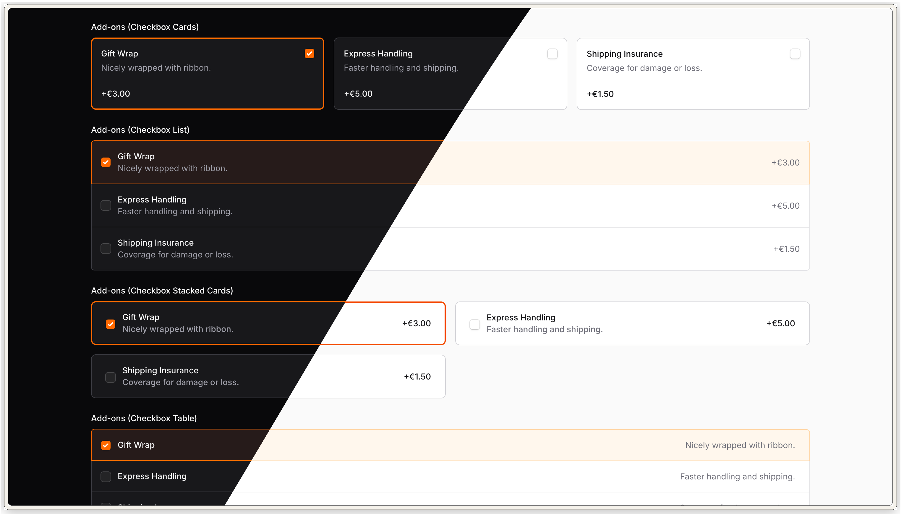
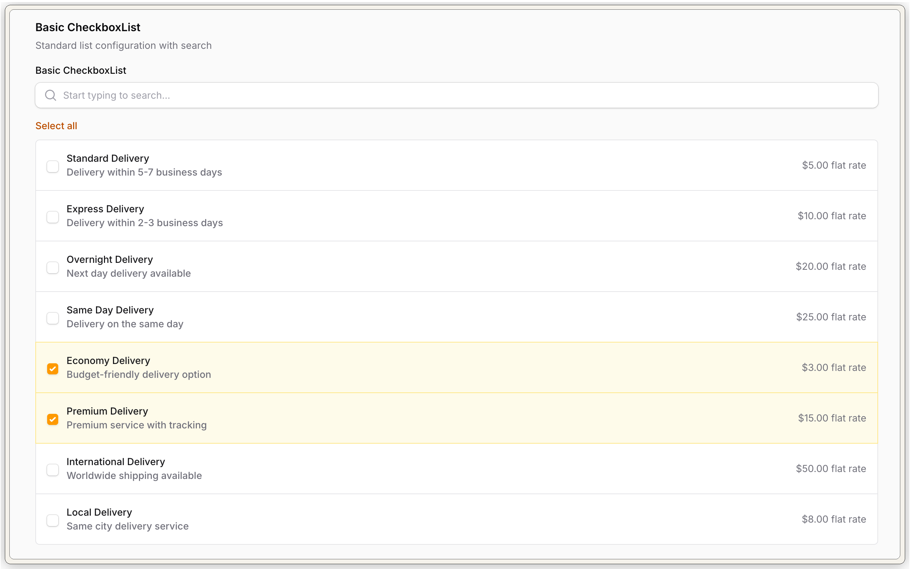
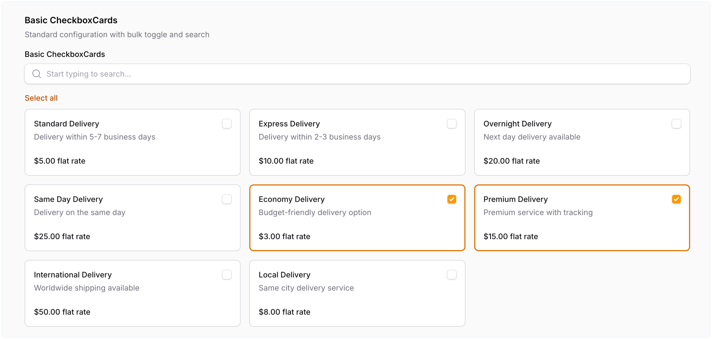
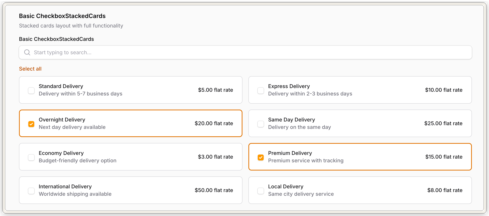
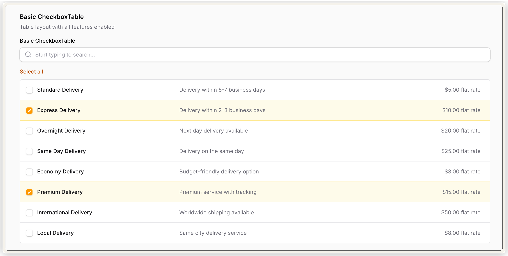
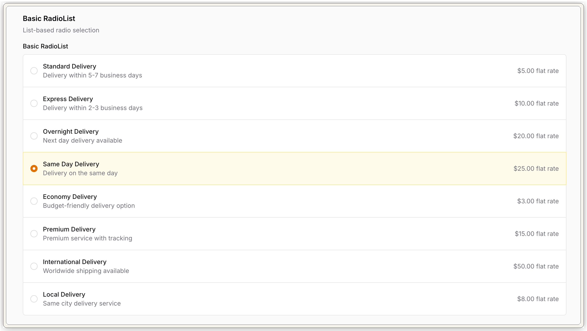
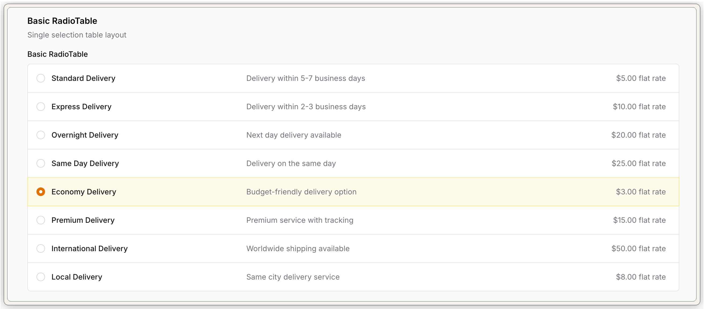
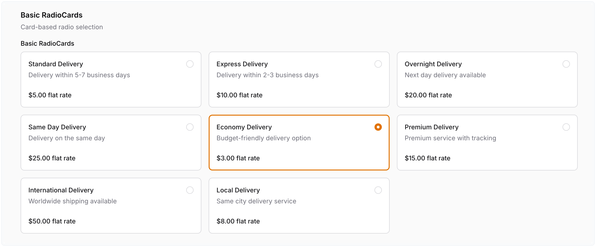
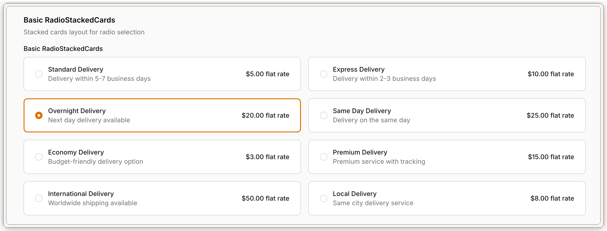

# Filament Advanced Choice

[](https://packagist.org/packages/codewithdennis/filament-advanced-choice)
[](https://packagist.org/packages/codewithdennis/filament-advanced-choice)
[](https://github.com/codewithdennis/filament-advanced-choice/blob/main/LICENSE)

This package adds eight form fields for FilamentPHP. Four extend `Radio`, four extend `CheckboxList`. Each uses its own Blade view; the PHP API matches the FilamentPHP types they extend.



## Requirements

| | |
|---|---|
| This package | **1.x** (`codewithdennis/filament-advanced-choice`) |
| Stack | **Laravel** with **FilamentPHP** forms (`filament/forms` **^4.0** or **^5.0**) |
| PHP | **8.1** or newer |

## Installation

**1.** Install with Composer:

```bash
composer require codewithdennis/filament-advanced-choice
```

**2.** In your FilamentPHP panel theme CSS (for example `resources/css/filament/{panel}/theme.css`), add an `@source` line so Tailwind scans this package’s Blade files. Adjust the `../` depth so it resolves from that CSS file to `vendor/codewithdennis/filament-advanced-choice/resources/**/*.blade.php`.

```css
@source '../../../../vendor/codewithdennis/filament-advanced-choice/resources/**/*.blade.php';
```

**3.** Run `npm run build` or `npm run dev` so the theme rebuilds.

## Quick start

`RadioCards` with labels, `descriptions()`, and `extras()`:

```php
use CodeWithDennis\FilamentAdvancedChoice\Filament\Forms\Components\RadioCards;

RadioCards::make('plan')
    ->options([
        'hobby' => 'Hobby',
        'pro' => 'Pro',
    ])
    ->descriptions([
        'hobby' => 'For side projects',
        'pro' => 'For teams',
    ])
    ->extras([
        'hobby' => '$9/mo',
        'pro' => '$29/mo',
    ]);
```

## Components

### CheckboxList

Vertical list layout with descriptions for multiple selections.



```php
CheckboxList::make('delivery_type')
    ->searchable()
    ->bulkToggleable()
    ->options([
        'standard' => 'Standard Delivery',
        'express' => 'Express Delivery',
        'overnight' => 'Overnight Delivery',
        'same_day' => 'Same Day Delivery',
        'economy' => 'Economy Delivery',
        'premium' => 'Premium Delivery',
        'international' => 'International Delivery',
        'local' => 'Local Delivery',
    ])
    ->descriptions([
        'standard' => 'Delivery within 5-7 business days',
        'express' => 'Delivery within 2-3 business days',
        'overnight' => 'Next day delivery available',
        'same_day' => 'Delivery on the same day',
        'economy' => 'Budget-friendly delivery option',
        'premium' => 'Premium service with tracking',
        'international' => 'Worldwide shipping available',
        'local' => 'Same city delivery service',
    ])
    ->extras([
        'standard' => '$5.00 flat rate',
        'express' => '$10.00 flat rate',
        'overnight' => '$20.00 flat rate',
        'same_day' => '$25.00 flat rate',
        'economy' => '$3.00 flat rate',
        'premium' => '$15.00 flat rate',
        'international' => '$50.00 flat rate',
        'local' => '$8.00 flat rate',
    ]);
```

### CheckboxCards

Card-based layout with descriptions and extras support for multiple selections.



```php
CheckboxCards::make('delivery_type')
    ->searchable()
    ->bulkToggleable()
    ->options([
        'standard' => 'Standard Delivery',
        'express' => 'Express Delivery',
        'overnight' => 'Overnight Delivery',
        'same_day' => 'Same Day Delivery',
        'economy' => 'Economy Delivery',
        'premium' => 'Premium Delivery',
        'international' => 'International Delivery',
        'local' => 'Local Delivery',
    ])
    ->descriptions([
        'standard' => 'Delivery within 5-7 business days',
        'express' => 'Delivery within 2-3 business days',
        'overnight' => 'Next day delivery available',
        'same_day' => 'Delivery on the same day',
        'economy' => 'Budget-friendly delivery option',
        'premium' => 'Premium service with tracking',
        'international' => 'Worldwide shipping available',
        'local' => 'Same city delivery service',
    ])
    ->extras([
        'standard' => '$5.00 flat rate',
        'express' => '$10.00 flat rate',
        'overnight' => '$20.00 flat rate',
        'same_day' => '$25.00 flat rate',
        'economy' => '$3.00 flat rate',
        'premium' => '$15.00 flat rate',
        'international' => '$50.00 flat rate',
        'local' => '$8.00 flat rate',
    ]);
```

### CheckboxStackedCards

Stacked card layout with descriptions and extras support for multiple selections.



```php
CheckboxStackedCards::make('delivery_type')
    ->options(DeliveryTypeEnum::class)
    ->searchable()
    ->bulkToggleable();
```

### CheckboxTable

Responsive table layout with descriptions for multiple selections.



```php
CheckboxTable::make('delivery_type')
    ->options(DeliveryTypeEnum::class)
    ->searchable()
    ->bulkToggleable();
```

### RadioList

Vertical list layout with descriptions.



```php
RadioList::make('delivery_type')
    ->options(DeliveryTypeEnum::class);
```

### RadioTable

Responsive table layout with descriptions.



```php
RadioTable::make('delivery_type')
    ->options(DeliveryTypeEnum::class);
```

### RadioCards

Card-based layout with descriptions and extras support.



```php
RadioCards::make('delivery_type')
    ->options(DeliveryTypeEnum::class);
```

### RadioStackedCards

Stacked card layout with descriptions and extras support.



```php
RadioStackedCards::make('delivery_type')
    ->options(DeliveryTypeEnum::class);
```

## Search, bulk actions, and disabling options

These come from FilamentPHP’s `Radio` and `CheckboxList` APIs (inherited unchanged).

Search:

```php
CheckboxList::make('delivery_type')
    ->options(DeliveryTypeEnum::class)
    ->searchable()
    ->searchPrompt('Search delivery types...')
    ->noSearchResultsMessage('No delivery types found.');
```

Bulk select (checkbox-style fields only):

```php
CheckboxList::make('delivery_type')
    ->options(DeliveryTypeEnum::class)
    ->bulkToggleable();
```

Disable one option:

```php
CheckboxList::make('delivery_type')
    ->options(DeliveryTypeEnum::class)
    ->disableOptionWhen(fn (string $value): bool => $value === 'premium');
```

## Enum support

Pass a backed enum class name to `options()` instead of an array. Implement:

- `Filament\Support\Contracts\HasLabel` (main label)
- `Filament\Support\Contracts\HasDescription` (subtitle)
- `CodeWithDennis\FilamentAdvancedChoice\Filament\Interfaces\HasExtra` (`extras()` column)

<details>
<summary><strong>Full enum example</strong></summary>

```php
<?php

declare(strict_types=1);

namespace App\Enums;

use CodeWithDennis\FilamentAdvancedChoice\Filament\Interfaces\HasExtra;
use Filament\Support\Contracts\HasDescription;
use Filament\Support\Contracts\HasLabel;

enum DeliveryTypeEnum: string implements HasDescription, HasExtra, HasLabel
{
    case Standard = 'standard';
    case Express = 'express';
    case Overnight = 'overnight';
    case SameDay = 'same_day';
    case Economy = 'economy';
    case Premium = 'premium';
    case International = 'international';
    case Local = 'local';

    public function getLabel(): string
    {
        return match ($this) {
            self::Standard => __('Standard Delivery'),
            self::Express => __('Express Delivery'),
            self::Overnight => __('Overnight Delivery'),
            self::SameDay => __('Same Day Delivery'),
            self::Economy => __('Economy Delivery'),
            self::Premium => __('Premium Delivery'),
            self::International => __('International Delivery'),
            self::Local => __('Local Delivery'),
        };
    }

    public function getDescription(): string
    {
        return match ($this) {
            self::Standard => __('Delivery within 5-7 business days'),
            self::Express => __('Delivery within 2-3 business days'),
            self::Overnight => __('Next day delivery available'),
            self::SameDay => __('Delivery on the same day'),
            self::Economy => __('Budget-friendly delivery option'),
            self::Premium => __('Premium service with tracking'),
            self::International => __('Worldwide shipping available'),
            self::Local => __('Same city delivery service'),
        };
    }

    public function getExtra(): ?string
    {
        return match ($this) {
            self::Standard => __('$5.00 flat rate'),
            self::Express => __('$10.00 flat rate'),
            self::Overnight => __('$20.00 flat rate'),
            self::SameDay => __('$25.00 flat rate'),
            self::Economy => __('$3.00 flat rate'),
            self::Premium => __('$15.00 flat rate'),
            self::International => __('$50.00 flat rate'),
            self::Local => __('$8.00 flat rate'),
        };
    }
}
```

</details>

<details>
<summary><strong>Example schema snippet</strong></summary>

```php
use App\Enums\DeliveryTypeEnum;
use CodeWithDennis\FilamentAdvancedChoice\Filament\Forms\Components\RadioStackedCards;
use Filament\Schemas\Schema;

public static function configure(Schema $schema): Schema
{
    return $schema
        ->columns(1)
        ->components([
            RadioStackedCards::make('delivery_type')
                ->options(DeliveryTypeEnum::class),
        ]);
}
```

</details>

If a case implements `getColor()`, some layouts tint that option (same idea as core FilamentPHP enums).

Either pass `extras([...])` keyed by the enum value, or rely on `getExtra()` on each case.

## Customization

### Field color

```php
use Filament\Support\Colors\Color;

CheckboxCards::make('plan')
    ->options(Plan::class)
    ->color(Color::Rose);
```

### Hide native inputs on cards

```php
CheckboxCards::make('delivery_type')
    ->options(DeliveryTypeEnum::class)
    ->hiddenInputs();
```

### Hidden input icon

By default, the hidden input icon for card components is `heroicon-s-check-circle`. You can override it:

```php
RadioCards::make('delivery_type')
    ->options(DeliveryTypeEnum::class)
    ->hiddenInputIcon('heroicon-o-chevron-double-down')
    ->hiddenInputs();
```

`visibleInputs()` reverses `hiddenInputs()` (shows the native control again).

## Changelog

See [CHANGELOG.md](CHANGELOG.md) and [GitHub Releases](https://github.com/codewithdennis/filament-advanced-choice/releases).

## Contributing

Pull requests welcome. For larger changes, open a GitHub issue first. Run `composer analyse` and `composer format` before opening a PR.

## Security

Report suspected vulnerabilities per [.github/SECURITY.md](.github/SECURITY.md). Do not post exploit details in a public issue.

## License

MIT. See [LICENSE](LICENSE).
